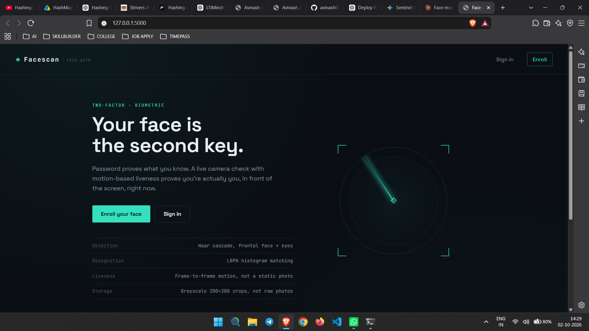
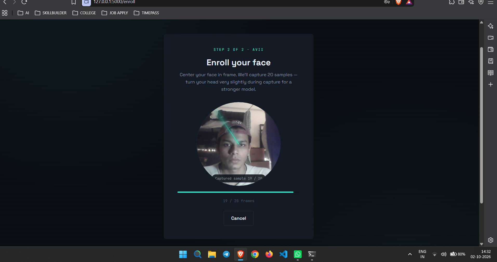
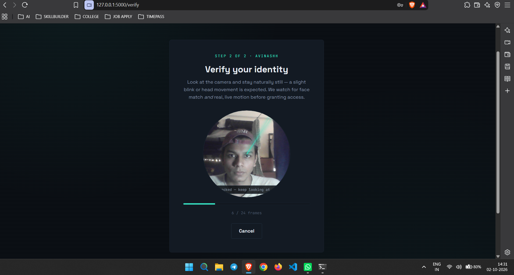
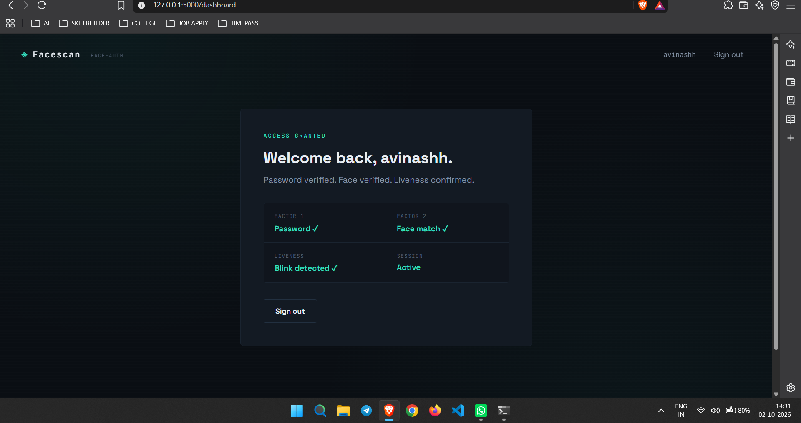

<div align="center">

# 🔐 Facescan

### Face Recognition-Based Two-Factor Secure Login

A complete, working two-factor login system — **password + live face verification** — built with Flask and OpenCV. Runs entirely locally: no cloud APIs, no external face-recognition service.

*Your face is the second key.*
**Theme:** Cybersecurity / Biometric Authentication · **Category:** Software

[](https://www.python.org/)
[](https://flask.palletsprojects.com/)
[](https://opencv.org/)
[](https://www.sqlite.org/)
[](https://developer.mozilla.org/en-US/docs/Web/API/MediaDevices/getUserMedia)

</div>

---

# 📌 Overview

Facescan is a two-factor authentication prototype that combines something you **know** (a password) with something you **are** (your face, verified live on camera). A password alone proves what you know; Facescan adds a live camera check with motion-based liveness to prove you are actually in front of the screen, right now.

Everything runs locally. Face images never leave the machine, and only cropped, grayscale, normalized 200×200 face samples are stored — never the raw camera frame.

It was designed to address three practical problems of face-based login: **enrollment quality** (capturing enough varied samples), **spoofing** (a static photo should not pass), and **privacy** (no external services, no raw frames saved).

---

# ✨ Features

## 👤 Registration & Enrollment

- Username + password registration, with passwords stored as **salted hashes**
- Guided webcam enrollment capturing **20 face samples** per user
- Samples are cropped, grayscale-normalized and used to train a personal **LBPH** recognition model
- Subtle head movement during capture is encouraged for a stronger model

---

## 🔑 Two-Factor Login

- **Factor 1:** password check
- **Factor 2:** live face verification on camera
- Dashboard is reachable **only** after both factors succeed

---

## 🧠 Face Detection & Recognition

- **Detection:** OpenCV Haar cascades (frontal face + eyes), bundled with OpenCV — no extra downloads
- **Recognition:** `cv2.face.LBPHFaceRecognizer` (from `opencv-contrib-python`), trained on all enrolled users with each user's database ID as the label
- Every verification frame is classified and a **majority match** within a confidence threshold is required (lower confidence value = closer match)

---

## 🧍 Motion-Based Liveness

- During the ~24-frame verification sequence, the detected face region is downsampled to a **16×16 thumbnail** each frame and compared with the previous frame
- A real face shows natural frame-to-frame movement (blinks, micro head motion, breathing); a printed photo or frozen screen does not
- If no frame pair exceeds `MOTION_DIFF_THRESHOLD`, verification **fails even if the face matches**
- More robust across consumer webcams and lighting than trying to catch a discrete "eyes closed" frame with a Haar eye cascade

---

## 🖥️ Clean Dark-Mode UI

- Landing page, registration, login, webcam capture and protected dashboard
- Live progress bar and status messages during enrollment and verification
- Shared capture screen for both enroll and verify flows

---

# 🛠 Tech Stack

## Backend & Recognition

- Python
- Flask (routes, sessions, API endpoints)
- OpenCV + `opencv-contrib-python` (Haar cascades, LBPH recognizer)
- NumPy

---

## Data & Frontend

- SQLite (users table)
- HTML / CSS / vanilla JavaScript
- `getUserMedia` webcam capture loop (`capture.js`)

---

## Tools

- Git / GitHub
- Runs fully locally — no cloud APIs

---

# 📂 Project Structure

```
face_login/
│
├── app.py                    # Flask app: routes, DB, face detection/training/verification
├── requirements.txt
├── database.db                # SQLite (created on first run) — users table
├── model.yml                   # Trained LBPH model (created after first enrollment)
├── face_data/<username>/        # Cropped grayscale 200x200 face samples per user
│
├── templates/
│   ├── base.html               # Shared layout/nav
│   ├── index.html              # Landing page
│   ├── register.html           # Step 1: create credentials
│   ├── login.html               # Step 1: sign in with password
│   ├── capture.html              # Step 2: webcam capture (shared by enroll + verify)
│   └── dashboard.html            # Protected page after full login
│
├── static/
│   ├── css/style.css           # Design system
│   └── js/capture.js            # getUserMedia capture loop + API calls
│
├── screenshots/                 # App screenshots used in this README
└── README.md
```

---

# 🔎 Authentication Flow

```
Register (username + password, salted hash)

↓

Enroll Face (20 samples → crop → grayscale → equalize → train LBPH model)

↓

Sign In — Factor 1: Password

↓

Factor 2: Live Camera Verification (~24 frames)

↓

┌───────────────────────────┬───────────────────────────┐
│ Haar Face Detection       │ Motion Liveness Check     │
│ + LBPH Recognition        │ (16x16 frame-diff)        │
│ (majority match)          │                           │
└───────────────────────────┴───────────────────────────┘

↓

Both pass?  →  Dashboard (Access Granted)
```

---

# 📸 App Preview

### Landing Page

> Two-factor biometric entry point — Enroll your face or Sign in — with a summary of the detection, recognition, liveness and storage approach.



---

### Step 2 of 2 — Enroll Your Face

> Guided capture of 20 face samples with a live progress bar (shown here at sample 19 / 20).



---

### Step 2 of 2 — Verify Your Identity

> Live verification after the password step: the system checks for a face match *and* real, live motion across ~24 frames.



---

### Dashboard — Access Granted

> Reached only after both factors pass: password verified, face verified, liveness confirmed.



---

# 🚀 Getting Started

## Clone Repository

```bash
git clone https://github.com/avinash09-cmd/facescan.git

cd facescan
```

---

## Install Dependencies

```bash
pip install -r requirements.txt
```

---

## Run the App

```bash
python app.py
```

Open **http://localhost:5000** in a browser with webcam access (Chrome / Firefox / Edge all work; the browser will prompt for camera permission).

> Camera access via `getUserMedia` requires either `localhost` or HTTPS — it will not work over plain `http://<ip>` from another machine.

---

## Usage

1. Click **Enroll your face** → create a username + password
2. Center your face and let the app capture 20 samples
3. Click **Sign in** → enter your password (Factor 1)
4. Look at the camera for live verification (Factor 2)
5. On success, you land on the protected dashboard

---

# ⚙️ Tuning Knobs

Defined at the top of `app.py`:

| Constant | Meaning |
|---|---|
| `SAMPLES_PER_USER` | How many frames to capture during enrollment (default 20) |
| `VERIFY_FRAMES_NEEDED` | Frames captured per login attempt (default 15) |
| `LBPH_CONFIDENCE_THRESHOLD` | Lower = stricter match required (default 75) |
| `MOTION_DIFF_THRESHOLD` | Min average pixel change (0–255) between frames to count as "alive" (default 2.2). Lower it if real logins fail liveness in bright, still conditions; raise it if a held-still photo passes. |

---

# 🌟 Highlights

- True two-factor flow: knowledge (password) + inherence (live face)
- Liveness is part of the decision — a matching face alone is **not** enough
- Fully local: no cloud APIs, no third-party face-recognition service
- Privacy-minded storage: only cropped, grayscale, equalized 200×200 samples are saved — never raw frames
- Honest about limitations (see below) rather than overselling the security

---

# ⚠️ Known Limitations

- **LBPH is a classical, lightweight recognizer** — fine for a personal / small-scale demo, but far less accurate than deep-learning embeddings (FaceNet / ArcFace) at scale or under varied lighting and pose.
- **Motion-based liveness is a basic heuristic**, not a robust anti-spoofing system. It stops naive static-photo replay, but **not** a video of the enrolled user played on a phone or screen. Production systems combine multiple signals (texture / depth analysis, challenge-response, IR sensors).
- **Single-process dev server** (`app.run(debug=True)`). For real deployment, use a production WSGI server (gunicorn / uwsgi) with `debug=False`, set a strong `FLASK_SECRET_KEY` environment variable, and serve over HTTPS.
- **Biometric data is sensitive.** Encrypt at rest and follow applicable regulations (GDPR, India's DPDP Act, etc.) for consent, storage and deletion if you extend this beyond local / personal use.

---

# 📈 Future Improvements

- Swap LBPH for deep face embeddings (FaceNet / ArcFace) for better accuracy across lighting and pose
- Challenge-response liveness (e.g. "turn left", "blink twice") and texture / depth-based anti-spoofing to defeat video replay
- Encrypt face samples and the trained model at rest
- Rate limiting and lockout on repeated failed verification attempts
- Production deployment: gunicorn + HTTPS, environment-based secrets
- Per-user adaptive thresholds calibrated during enrollment

---

# 👨‍💻 Author

## Avinash Kumar Singh

B.Tech CSE (Cyber Security & Digital Forensics) · VIT Bhopal

### Connect with me

- GitHub: https://github.com/avinash09-cmd

---

<div align="center">

### ⭐ If you found this project helpful, consider giving it a star!

Built with Flask, OpenCV & LBPH

</div>
